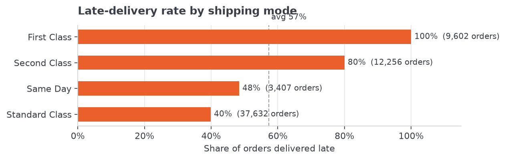
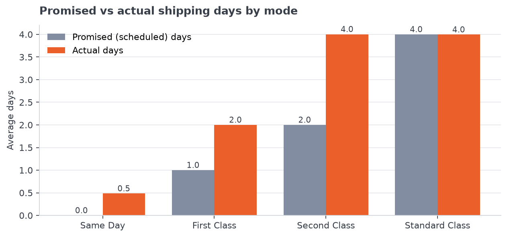

# Delivery Risk Analytics

Why do so many orders arrive late, and where should a company fix it first?

This project analyses a global retailer's order data to find the causes of late deliveries and how much revenue they put at risk.

**Status:** Data cleaning, exploratory analysis and SQL analysis done. Dashboard coming next.

## Key findings

- **57.3% of orders arrive late**, by 1.62 days on average.
- **Shipping mode is the main cause.** First Class is late on 100% of orders and Second Class on 80%, compared with 40% for Standard Class. Together, First and Second Class account for 53.8% of all late orders.
- **The problem is the delivery promise, not the delivery speed.** First Class promises 1 day and always takes 2. Second Class promises 2 days but takes 4, the same as Standard Class. Customers paying for faster shipping get no faster delivery.
- **Location and product don't explain it.** Late rates stay in a narrow range across regions (52.6%–60.0%) and product categories (about 56%–60%).
- **57.2% of sales (20.1M of 35.2M) are on late orders.** Profit margin is almost the same for late and on-time orders (10.6% vs 11.0%), so the real cost is customer trust and revenue at risk.
- **Where to act first:** the riskiest shipping lane is [lane from query 5.3], and the top 5 lanes hold [X]% of all revenue on late orders. If every above-average lane matched the company average, about [X]M in sales would no longer be late.

## Dataset

**Download:** [DataCo Smart Supply Chain dataset on Kaggle](https://www.kaggle.com/datasets/shashwatwork/dataco-smart-supply-chain-for-big-data-analysis)

- After cleaning: 172,765 rows covering 62,897 orders, from January 2015 onwards
- Each row is one product in an order, so one order can have several rows
- The data file isn't in this repo because it's too large. Download it from the link above.

## Step 1: Data cleaning

Notebook: `Data_Cleaning/Data Cleaning.ipynb`

- Removed duplicate rows and columns that were empty or held personal customer details
- Converted dates into a proper date format
- Added new columns: how many days late each order was, and whether it was late (yes/no)
- Set cancelled orders aside, since they were never shipped
- Checked the numbers made sense (no negative sales or quantities)

## Step 2: Exploratory analysis

Notebook: `EDA/EDA.ipynb`

Looked at late deliveries by shipping mode, region, product category, month and customer type, compared promised vs actual delivery days, and measured how much revenue sits on late orders. All charts are in the `Images/` folder.

## Step 3: SQL analysis

File: `SQL_Analysis/SQL_Analysis.sql`

- Loaded the clean data into SQL Server (running in Docker on a Mac)
- Built an order-level view, so each order is counted once rather than once per product
- Re-checked every Python finding in SQL; all numbers matched
- Ranked every shipping lane (region + shipping mode) from worst to best
- Tracked the monthly late rate and its change from month to month
- Found which product categories make up 80% of sales: [X] of [Y] categories
- Built a risk score (0–100) for each shipping lane, based on how often it's late, how much revenue it affects, how late its orders are, and how many late orders lose money

## Tools

Python (pandas, Matplotlib) · SQL Server · Docker

## Next steps

- [x] Clean the data
- [x] Explore the data and find patterns
- [x] Analyse it in SQL
- [x] Score which shipping routes are most at risk
- [ ] Build an interactive dashboard

---

**Ankit Jandial** · [LinkedIn](https://www.linkedin.com/in/ankit-jandial-655300159/)
